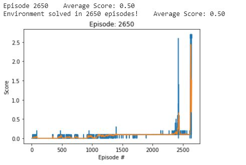

# Project 3: Collaboration and Competition

## Description of the implementation

### MADDPG: Multi Agent Deep Deterministic Policy Gradient

MADDPG, or Multi-agent DDPG, extends DDPG into a multi-agent policy gradient algorithm where decentralized agents learn a centralized critic 
based on the observations and actions of all agents. It leads to learned policies that only use local information (i.e. their own observations) at execution time, 
does not assume a differentiable model of the environment dynamics or any particular structure on the communication method between agents, 
and is applicable not only to cooperative interaction but to competitive or mixed interaction involving both physical and communicative behavior.

For more information on MADDPG click [here](https://towardsdatascience.com/openais-multi-agent-deep-deterministic-policy-gradients-maddpg-9d2dad34c82)

### Implementation

- `P3-TennisProject.ipynb`: contains the training code and training output.
- `agent.py`: contains the agent, noise and replay buffer classes. 
- `model.py`: contains the Actor and Critic neural networks used as the estimators.

#### Hyperparameters
The following hyperparameters were used:

* replay buffer size: 1e5
* max timesteps: 10000
* minibatch size: 512
* discount factor: 0.99
* tau (soft update for target networks factor): 1e-3
* learning rate: 1e-4 (actor) and 1e-3 (critic)
* update interval (how often to learn): 20
* noise start (factor for the noise added to the actions selected by the actor): 1.0
* noise decay factor: 0.999
* min noise: 0.01

#### Neural networks
The actor model is a simple feedforward network:
* Input layer: 24 (input) neurons (the state size)
* 1st hidden layer: 128 neurons (leaky relu)
* 2nd hidden layer: 128 neurons (leaky relu)
* output layer: 2 neurons (1 for each action) (tanh)

The critic model:
* Input layer: 24 (input) neurons (the state size)
* 1st hidden layer: 132 neurons (action with 2 * action_size 2 added) (leaky relu)
* 2nd hidden layer: 128 neurons (leaky relu)
* output layer: 1 neuron

### Plot of Rewards

### Future Improvements
The next steps after this submission is to implement Prioritized Experience Replay within the Replay Buffer for improved sampling from saved experiences.
Hyperparameters can also be further optimized along with the hidden layers of both Actor and Critic models.
